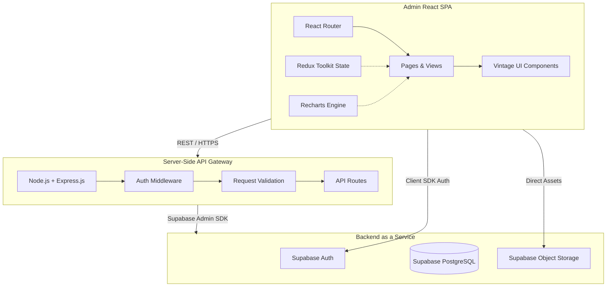
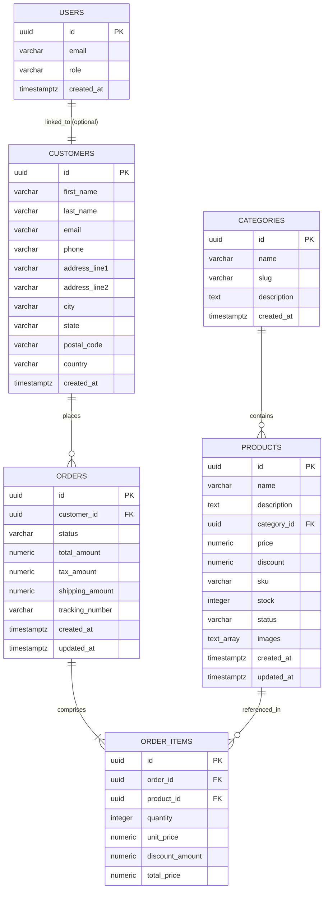

# S for Shopping - System Design Specification

This document details the system architecture, database design, API schemas, state management, UI design system, and security configurations for **S for Shopping**, a premium, admin-focused e-commerce management platform designed with a timeless **Vintage Editorial** aesthetic.

---

## 1. System Architecture & Data Flow

The platform utilizes a modern decoupled full-stack architecture optimized for low-latency CRUD operations, granular state management, and real-time visualization.



### Architectural Responsibilities
*   **Frontend (React + Vite)**: Renders the Vintage Editorial UI, manages active states via Redux, handles interactive client-side routing, and connects to Supabase client library directly for authentication and storage uploads.
*   **Backend (Node.js + Express)**: Provides wrapper API routes for complex analytical queries (e.g., dashboard charts, reports), transactional validation, and acts as a security middleware layer.
*   **BaaS (Supabase)**: Serves as the primary data store (PostgreSQL), handles user authentication/sessions, enforces Row Level Security (RLS) policies, and stores product assets in Object Storage.

---

## 2. Database Schema Design (PostgreSQL)

The database schema is designed with strict relational integrity constraints, foreign key cascades, check rules, and indexing for high performance.



### SQL DDL Scripts

```sql
-- Enable UUID extension
CREATE EXTENSION IF NOT EXISTS "uuid-ossp";

-- 1. USERS TABLE (Linked with Supabase Auth)
CREATE TABLE public.users (
    id UUID PRIMARY KEY REFERENCES auth.users(id) ON DELETE CASCADE,
    email VARCHAR(255) NOT NULL UNIQUE,
    role VARCHAR(50) NOT NULL DEFAULT 'admin' CHECK (role IN ('admin', 'staff')),
    created_at TIMESTAMPTZ NOT NULL DEFAULT CURRENT_TIMESTAMP
);

-- 2. CATEGORIES TABLE
CREATE TABLE public.categories (
    id UUID PRIMARY KEY DEFAULT uuid_generate_v4(),
    name VARCHAR(100) NOT NULL UNIQUE,
    slug VARCHAR(100) NOT NULL UNIQUE,
    description TEXT,
    created_at TIMESTAMPTZ NOT NULL DEFAULT CURRENT_TIMESTAMP
);

-- Create index on slug for fast retrieval
CREATE INDEX idx_categories_slug ON public.categories(slug);

-- 3. PRODUCTS TABLE
CREATE TABLE public.products (
    id UUID PRIMARY KEY DEFAULT uuid_generate_v4(),
    name VARCHAR(255) NOT NULL,
    description TEXT,
    category_id UUID REFERENCES public.categories(id) ON DELETE SET NULL,
    price NUMERIC(10, 2) NOT NULL CHECK (price >= 0),
    discount NUMERIC(5, 2) NOT NULL DEFAULT 0.00 CHECK (discount >= 0 AND discount <= 100), -- Discount percentage
    sku VARCHAR(100) NOT NULL UNIQUE,
    stock INTEGER NOT NULL DEFAULT 0 CHECK (stock >= 0),
    status VARCHAR(50) NOT NULL DEFAULT 'draft' CHECK (status IN ('active', 'draft', 'archived')),
    images TEXT[] NOT NULL DEFAULT '{}',
    created_at TIMESTAMPTZ NOT NULL DEFAULT CURRENT_TIMESTAMP,
    updated_at TIMESTAMPTZ NOT NULL DEFAULT CURRENT_TIMESTAMP
);

-- Indexes for product filtering and categorization
CREATE INDEX idx_products_sku ON public.products(sku);
CREATE INDEX idx_products_status ON public.products(status);
CREATE INDEX idx_products_category ON public.products(category_id);

-- 4. CUSTOMERS TABLE
CREATE TABLE public.customers (
    id UUID PRIMARY KEY DEFAULT uuid_generate_v4(),
    first_name VARCHAR(100) NOT NULL,
    last_name VARCHAR(100) NOT NULL,
    email VARCHAR(255) NOT NULL UNIQUE,
    phone VARCHAR(50),
    address_line1 VARCHAR(255) NOT NULL,
    address_line2 VARCHAR(255),
    city VARCHAR(100) NOT NULL,
    state VARCHAR(100) NOT NULL,
    postal_code VARCHAR(20) NOT NULL,
    country VARCHAR(100) NOT NULL DEFAULT 'United States',
    created_at TIMESTAMPTZ NOT NULL DEFAULT CURRENT_TIMESTAMP
);

CREATE INDEX idx_customers_email ON public.customers(email);

-- 5. ORDERS TABLE
CREATE TABLE public.orders (
    id UUID PRIMARY KEY DEFAULT uuid_generate_v4(),
    customer_id UUID NOT NULL REFERENCES public.customers(id) ON DELETE RESTRICT,
    status VARCHAR(50) NOT NULL DEFAULT 'pending' 
        CHECK (status IN ('pending', 'packed', 'shipped', 'delivered', 'cancelled')),
    total_amount NUMERIC(10, 2) NOT NULL CHECK (total_amount >= 0),
    tax_amount NUMERIC(10, 2) NOT NULL DEFAULT 0.00 CHECK (tax_amount >= 0),
    shipping_amount NUMERIC(10, 2) NOT NULL DEFAULT 0.00 CHECK (shipping_amount >= 0),
    tracking_number VARCHAR(100),
    created_at TIMESTAMPTZ NOT NULL DEFAULT CURRENT_TIMESTAMP,
    updated_at TIMESTAMPTZ NOT NULL DEFAULT CURRENT_TIMESTAMP
);

CREATE INDEX idx_orders_customer ON public.orders(customer_id);
CREATE INDEX idx_orders_status ON public.orders(status);
CREATE INDEX idx_orders_created_at ON public.orders(created_at);

-- 6. ORDER ITEMS TABLE
CREATE TABLE public.order_items (
    id UUID PRIMARY KEY DEFAULT uuid_generate_v4(),
    order_id UUID NOT NULL REFERENCES public.orders(id) ON DELETE CASCADE,
    product_id UUID REFERENCES public.products(id) ON DELETE SET NULL,
    quantity INTEGER NOT NULL CHECK (quantity > 0),
    unit_price NUMERIC(10, 2) NOT NULL CHECK (unit_price >= 0),
    discount_amount NUMERIC(10, 2) NOT NULL DEFAULT 0.00 CHECK (discount_amount >= 0),
    total_price NUMERIC(10, 2) NOT NULL CHECK (total_price >= 0)
);

CREATE INDEX idx_order_items_order ON public.order_items(order_id);
CREATE INDEX idx_order_items_product ON public.order_items(product_id);

-- Automatic updated_at Trigger for products and orders
CREATE OR REPLACE FUNCTION update_updated_at_column()
RETURNS TRIGGER AS $$
BEGIN
    NEW.updated_at = NOW();
    RETURN NEW;
END;
$$ LANGUAGE plpgsql;

CREATE TRIGGER update_products_updated_at
BEFORE UPDATE ON public.products
FOR EACH ROW EXECUTE FUNCTION update_updated_at_column();

CREATE TRIGGER update_orders_updated_at
BEFORE UPDATE ON public.orders
FOR EACH ROW EXECUTE FUNCTION update_updated_at_column();
```

---

## 3. REST API Contract

All requests and responses use JSON bodies. Protected routes require a Supabase Authorization Bearer Token (`Authorization: Bearer <JWT>`).

### 3.1 Authentication

#### `POST /api/auth/login`
*   **Access**: Public
*   **Request Body**:
    ```json
    {
      "email": "admin@sshopping.com",
      "password": "password123"
    }
    ```
*   **Response (200 OK)**:
    ```json
    {
      "token": "eyJhbGciOi...",
      "user": {
        "id": "e9c0c1b4-...",
        "email": "admin@sshopping.com",
        "role": "admin"
      }
    }
    ```

---

### 3.2 Products CRUD

#### `GET /api/products`
*   **Access**: Protected (Admin/Staff)
*   **Query Parameters**: `category_id`, `status`, `search`, `page`, `limit`
*   **Response (200 OK)**:
    ```json
    {
      "data": [
        {
          "id": "a8f7c9e0-...",
          "name": "Vintage Trench Coat",
          "sku": "APP-TRS-001",
          "price": 189.00,
          "discount": 10.00,
          "stock": 14,
          "status": "active",
          "category": { "id": "b1b2...", "name": "Apparel" },
          "images": ["https://supabase.co/storage/v1/object/public/products/trench1.jpg"]
        }
      ],
      "pagination": { "total": 48, "page": 1, "pages": 5 }
    }
    ```

#### `POST /api/products`
*   **Access**: Protected (Admin)
*   **Request Body**:
    ```json
    {
      "name": "Vintage Leather Brogues",
      "description": "Premium full-grain leather classic footwear.",
      "category_id": "b1b2c3d4-...",
      "price": 240.00,
      "discount": 0.00,
      "sku": "SH-BRG-002",
      "stock": 25,
      "status": "active",
      "images": ["https://supabase.co/.../brogues.jpg"]
    }
    ```
*   **Response (201 Created)**: Returns the newly created product object.

---

### 3.3 Orders Management

#### `GET /api/orders`
*   **Access**: Protected
*   **Query Parameters**: `status`, `page`, `limit`
*   **Response (200 OK)**:
    ```json
    {
      "data": [
        {
          "id": "c7a8b9d0-...",
          "customer": { "first_name": "Arthur", "last_name": "Pendragon" },
          "total_amount": 420.00,
          "status": "pending",
          "created_at": "2026-06-29T10:15:30Z"
        }
      ],
      "pagination": { "total": 120, "page": 1, "pages": 12 }
    }
    ```

#### `PUT /api/orders/:id/status`
*   **Access**: Protected
*   **Request Body**:
    ```json
    {
      "status": "packed"
    }
    ```
*   **Response (200 OK)**:
    ```json
    {
      "id": "c7a8b9d0-...",
      "status": "packed",
      "updated_at": "2026-06-29T16:24:00Z"
    }
    ```

---

### 3.4 Reports and Dashboard Analytics

#### `GET /api/reports/summary`
*   **Access**: Protected
*   **Response (200 OK)**:
    ```json
    {
      "total_products": 248,
      "total_orders": 1420,
      "revenue": 184500.50,
      "low_stock_count": 8
    }
    ```

#### `GET /api/reports/sales-chart`
*   **Access**: Protected
*   **Query Parameters**: `range` (e.g., `7d`, `30d`, `1y`)
*   **Response (200 OK)**:
    ```json
    [
      { "date": "2026-06-23", "revenue": 1200.00, "orders": 5 },
      { "date": "2026-06-24", "revenue": 1850.50, "orders": 8 }
    ]
    ```

---

## 4. State Management (Redux Toolkit)

The client uses Redux Toolkit for caching database states, managing auth tokens, and toggling loading and feedback overlays.

```javascript
// Store Config (src/store/index.js)
import { configureStore } from '@reduxjs/toolkit';
import authReducer from './slices/authSlice';
import productReducer from './slices/productSlice';
import categoryReducer from './slices/categorySlice';
import orderReducer from './slices/orderSlice';
import uiReducer from './slices/uiSlice';

export const store = configureStore({
  reducer: {
    auth: authReducer,
    products: productReducer,
    categories: categoryReducer,
    orders: orderReducer,
    ui: uiReducer,
  },
});
```

### Slices Specifications
1.  **Auth Slice (`authSlice.js`)**:
    *   State: `user`, `token`, `isAuthenticated`, `loading`, `error`.
    *   Actions: `loginSuccess()`, `logout()`, `clearError()`.
2.  **Product Slice (`productSlice.js`)**:
    *   State: `productsList`, `currentProduct`, `filters`, `loading`, `error`.
    *   Actions: `setProducts()`, `setFilters()`, `addProduct()`, `updateProduct()`, `removeProduct()`.
3.  **Order Slice (`orderSlice.js`)**:
    *   State: `ordersList`, `currentOrderDetail`, `loading`, `error`.
    *   Actions: `setOrders()`, `updateOrderStatus()`.
4.  **UI Slice (`uiSlice.js`)**:
    *   State: `sidebarOpen`, `themeMode` (vintage-editorial), `activeToast` (null | ToastMessage).
    *   Actions: `toggleSidebar()`, `showToast()`, `dismissToast()`.

---

## 5. Folder Structure

The project code is divided into `admin/` and `server/` root directories:

```
S-FOR-SHOPPING/
├── admin/
│   ├── public/
│   ├── src/
│   │   ├── assets/           # Editorial vector graphics, logo textures
│   │   ├── components/       # Custom shared Vintage UI components
│   │   │   ├── Button.jsx    # Outlined vintage CTA buttons
│   │   │   ├── Card.jsx      # Sharp-bordered container blocks
│   │   │   ├── Table.jsx     # Typographic lists with thin divider lines
│   │   │   └── Layout.jsx    # Sidebar and Main editorial layout
│   │   ├── features/         # Module-specific code
│   │   │   ├── auth/
│   │   │   ├── dashboard/
│   │   │   ├── products/
│   │   │   ├── categories/
│   │   │   └── orders/
│   │   ├── store/            # Redux store structure and slices
│   │   ├── routes/           # React Router pathways
│   │   ├── index.css         # Typography configuration and custom classes
│   │   ├── tailwind.config.js# Design system tokens integration
│   │   └── main.jsx          # Entry point
│   ├── package.json
│   └── vite.config.js
│
├── server/
│   ├── config/               # Supabase and system configurations
│   ├── middleware/           # Auth validation and error handlers
│   ├── controllers/          # Endpoint business logic
│   ├── routes/               # Express routing tables
│   ├── index.js              # Server entry point
│   ├── package.json
│   └── .env.example
│
├── PRD.md
└── DESIGN.md
```

---

## 6. UI/UX Design System (Vintage Editorial)

To deliver a premium, publication-grade vintage editorial design, the design system utilizes specialized typography, a custom color layout, and geometric structure.

### 6.1 Font Hierarchy (via Google Fonts)
*   **Headings**: *Cormorant Garamond* (Serif). Exudes classic publishing houses, premium editorials, and historic catalogues.
*   **Body & UI labels**: *Inter* or *Lora* (Sans-serif/Serif readability mix). Clean, legible, high-contrast UI labels.

### 6.2 Design Tokens Integration (Tailwind CSS config)
To capture the exact requirements of the PRD, the Tailwind configuration is extended as follows:

```javascript
// admin/tailwind.config.js
module.exports = {
  theme: {
    extend: {
      colors: {
        vintage: {
          bg: '#F5F1E8',       // Main canvas background (cream)
          card: '#FAF8F3',     // Content cards (warm off-white)
          primary: '#2F2F2F',  // Primary typography, borders (charcoal)
          accent: '#8B5E3C',   // Golden-brown highlight / CTA (leather/accent)
          muted: '#7A756B',    // Soft descriptions, subtle labels
        }
      },
      fontFamily: {
        serif: ['"Cormorant Garamond"', 'serif'],
        sans: ['"Inter"', 'sans-serif'],
      },
      borderWidth: {
        'half': '0.5px',       // Thin editorial rule lines
      },
      boxShadow: {
        'vintage-flat': '4px 4px 0px 0px #2F2F2F', // Offset retro paper shadows
      }
    },
  },
}
```

### 6.3 Micro-Animations & Framer Motion Configurations
Avoid bouncy, futuristic transitions. Use linear or elegant spring-ease fades reminiscent of a turning catalog page:

```javascript
// Slide-up and Fade-in entry for dashboard content cards
export const vintagePageTransition = {
  initial: { opacity: 0, y: 15 },
  animate: { opacity: 1, y: 0, transition: { duration: 0.6, ease: [0.16, 1, 0.3, 1] } },
  exit: { opacity: 0, y: -15, transition: { duration: 0.3 } }
};
```

---

## 7. Security and Data Storage Plan

### 7.1 Supabase RLS (Row Level Security) Policies
To ensure database integrity, Row Level Security is configured directly in PostgreSQL.

*   **Users Profile Table**:
    *   `SELECT`: Authenticated users can view their own profiles.
    *   `UPDATE`: Only users with role `admin` can modify roles.
*   **Products & Categories Tables**:
    *   `SELECT`: Any authenticated admin/staff or client public view is permitted.
    *   `INSERT/UPDATE/DELETE`: Restricted exclusively to users with user role `admin`.
*   **Orders & Customers Tables**:
    *   `ALL`: Restricted to Authenticated `admin` or `staff`.

### 7.2 Storage Buckets Setup
A public bucket named `product-images` is created in Supabase.
*   **Security Policy**: Only authenticated administrators can `INSERT`, `UPDATE`, and `DELETE` items. Any visitor can read (`SELECT`) images.
*   **Folder Hierarchy**: `products/{sku}/{uuid_filename}.jpg` for structured asset organization.

---

## 8. Deployment & Environment Configuration

### Admin Environment Setup (`admin/.env`)
```env
VITE_SUPABASE_URL=https://your-project-id.supabase.co
VITE_SUPABASE_ANON_KEY=eyJhbGciOi...
VITE_API_URL=http://localhost:5000/api
```

### Server Environment Setup (`server/.env`)
```env
PORT=5000
SUPABASE_URL=https://your-project-id.supabase.co
SUPABASE_SERVICE_ROLE_KEY=eyJhbGciOi... (Used for admin privileges bypass)
JWT_SECRET=your_jwt_signing_key_here
NODE_ENV=development
```
