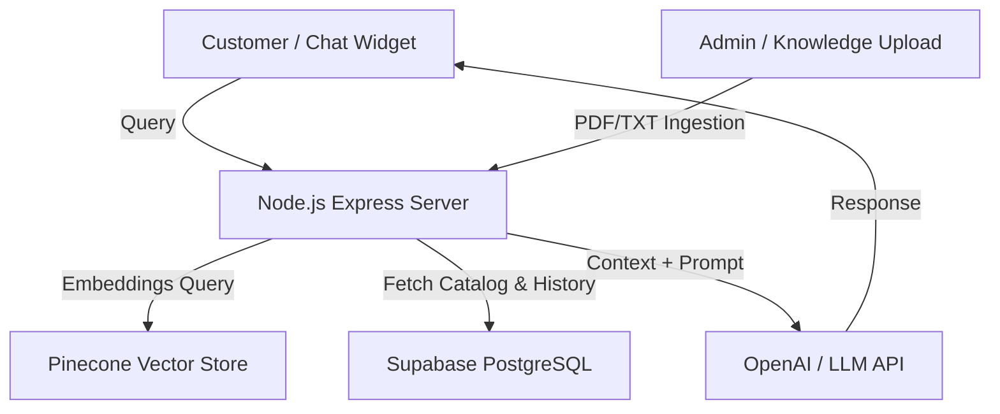

# Velora E-Commerce Platform & AI-Powered Chatbot

Velora is a modern, premium e-commerce platform built with a vintage editorial design aesthetic. It features an integrated, contextual AI Shopping Assistant (Velora Concierge) utilizing **Retrieval-Augmented Generation (RAG)** to provide accurate, personalized, and context-aware responses to store inquiries, policies, and products.

---

## 🏛️ System Architecture



The platform is split into three main components:
1. **[Customer Client](file:///d:/VELORA/customer):** React + Vite customer storefront featuring a live cart, order lifecycle management, product gallery, and the floating **Velora AI Concierge Widget**.
2. **[Admin Dashboard](file:///d:/VELORA/admin):** React + Vite administration workspace equipped with sales metrics, product catalog editors, order tracking logs, and a **Knowledge Manager** for uploading policy files directly into the vector index database.
3. **[API Server](file:///d:/VELORA/server):** Express.js API backend running LangChain, Pinecone vector querying, keyword synonym matching, Supabase adapters, and conversational memory logging.

---

## ✨ Core Features

*   💬 **Integrated AI Concierge:** Real-time chatbot interface supporting markdown rendering, product search suggestions, and relative item detail pages links.
*   📚 **Knowledge Ingestion:** Admin interface to register and parse files (`.pdf` / `.txt`), compute query embeddings, and catalog documents inside the database.
*   🔍 **Synonym-Aware Search:** Custom tokenized catalog search matching singular/plural e-commerce synonyms (e.g. `mobiles` mapping to phones, `laptops` mapping to MacBooks).
*   🧠 **Conversational Memory:** Preserves the last 10 messages of conversation history per customer session to ensure high-context response threads.
*   🔒 **Robust Fallback Routing:** Intelligent routing checks that direct general FAQ queries (returns, shipping, payments) to text policy documents, and specific product requests directly to catalog products.

---

## 🛠️ Tech Stack

*   **Frontend:** React (v19), Redux Toolkit, React Router, Vite, Tailwind CSS, Framer Motion, Lucide React
*   **Backend:** Node.js, Express, LangChain.js, `@langchain/openai`, `@pinecone-database/pinecone`
*   **Database & Auth:** Supabase (PostgreSQL, Real-Time Sync, Auth)
*   **Embeddings & LLM:** Hugging Face Embeddings (`sentence-transformers/all-MiniLM-L6-v2`) & OpenAI LLM APIs

---

## 🚀 Getting Started

### Prerequisites

-   Node.js (v18 or higher)
-   npm or yarn

### Environmental Configuration

Configure `.env` files inside each respective component subdirectory. Examples:

#### Backend (`/server/.env`)
```env
PORT=5000
NODE_ENV=development
SUPABASE_URL=https://<your-project>.supabase.co
SUPABASE_SERVICE_ROLE_KEY=<service-role-key>
JWT_SECRET=<jwt-secret-key>
USE_SUPABASE=true

# RAG & AI Config (Optional - Local fallback will run if empty)
OPENAI_API_KEY=sk-...
PINECONE_API_KEY=<pinecone-api-key>
PINECONE_INDEX=velora-chatbot-index
```

#### Customer Frontend (`/customer/.env`)
```env
VITE_SUPABASE_URL=https://<your-project>.supabase.co
VITE_SUPABASE_ANON_KEY=<anon-key>
VITE_API_URL=http://localhost:5000/api
```

#### Admin Frontend (`/admin/.env`)
```env
VITE_SUPABASE_URL=https://<your-project>.supabase.co
VITE_SUPABASE_ANON_KEY=<anon-key>
VITE_API_URL=http://localhost:5000/api
```

---

## 🏃 Running the Application

To start all components in development mode, run the dev servers in separate terminal panes:

1.  **Start API Server:**
    ```bash
    cd server
    npm run dev
    ```
    *(Runs on [http://localhost:5000](http://localhost:5000))*

2.  **Start Customer Web App:**
    ```bash
    cd customer
    npm run dev
    ```
    *(Runs on [http://localhost:5173](http://localhost:5173))*

3.  **Start Admin Panel:**
    ```bash
    cd admin
    npm run dev
    ```
    *(Runs on [http://localhost:5174](http://localhost:5174))*

---

## 🌐 Live Production Deployments

The application is deployed live on Vercel:

- 💻 **Customer Storefront:** [https://customer-iota-one.vercel.app](https://customer-iota-one.vercel.app)
- ⚙️ **Admin Dashboard:** [https://admin-nine-ivory-71.vercel.app](https://admin-nine-ivory-71.vercel.app)
- 🔌 **API Server Backend:** [https://server-tau-taupe-45.vercel.app](https://server-tau-taupe-45.vercel.app)
