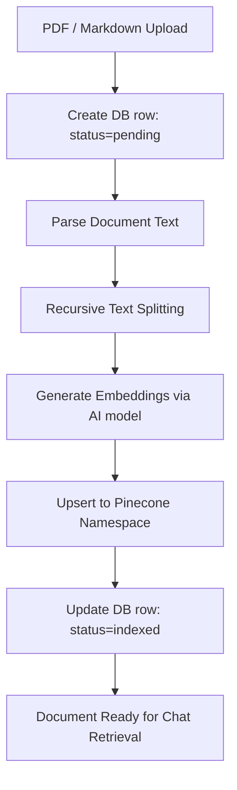

# Phase 2: Knowledge Base & Ingestion Pipeline

This document details the database schemas, document processing pipeline, text chunking strategies, and integration with the Pinecone Vector Database for **Phase 2: Knowledge Base**.

---

## 1. Goal
Implement a pipeline that allows store administrators to upload, parse, embed, and store company policy, FAQ, and catalog documents inside the database (PostgreSQL) and the Vector Store (Pinecone) to serve as search context for the RAG chatbot.

---

## 2. Database Schema Design (PostgreSQL & Pinecone)

### A. Document Metadata Table (PostgreSQL)
Create a new relational table to track file metadata, indexing status, and storage locations:
```sql
CREATE TABLE public.documents (
    id UUID PRIMARY KEY DEFAULT uuid_generate_v4(),
    title VARCHAR(255) NOT NULL,
    file_url TEXT NOT NULL,
    file_type VARCHAR(50) NOT NULL, -- e.g., 'pdf', 'txt', 'markdown'
    status VARCHAR(50) NOT NULL DEFAULT 'pending' CHECK (status IN ('pending', 'processing', 'indexed', 'failed')),
    vector_namespace VARCHAR(100) NOT NULL DEFAULT 'general',
    word_count INTEGER DEFAULT 0,
    error_message TEXT,
    created_at TIMESTAMPTZ NOT NULL DEFAULT CURRENT_TIMESTAMP,
    updated_at TIMESTAMPTZ NOT NULL DEFAULT CURRENT_TIMESTAMP
);

CREATE INDEX idx_documents_status ON public.documents(status);
```

### B. Vector Schema (Pinecone Payload)
Each vector record stored in the Pinecone index namespace must conform to the following metadata structure:
```json
{
  "id": "doc_uuid_chunk_index",
  "values": [0.012, -0.045, 0.231, "... (384/1536 dimensions depending on model)"],
  "metadata": {
    "document_id": "postgres_uuid",
    "text": "Chunk text content...",
    "title": "FAQ Shipping Rates",
    "namespace": "policies",
    "chunk_index": 0
  }
}
```

---

## 3. Ingestion & Vector Processing Pipeline

Implement the document upload controller under [server/controllers/knowledgeController.js](file:///d:/VELORA/server/controllers/knowledgeController.js). The pipeline must execute:



### Technical Specifications
1.  **Text Splitting Strategy**:
    *   Tool: LangChain `RecursiveCharacterTextSplitter`.
    *   Chunk Size: `500` characters.
    *   Overlap: `100` characters.
    *   Separators: `["\n\n", "\n", " ", ""]`.
2.  **File Parsing**:
    *   Plain text and Markdown: Parsed directly as strings.
    *   PDF files: Read and tokenized using `pdf-parse` extraction library.

### API Endpoint: `POST /api/admin/knowledge/upload`
- **Headers**: `Authorization: Bearer <JWT>`
- **Request (Multipart/Form-Data)**:
  *   `file`: Target document.
  *   `namespace`: Destination vector namespace (`policies`, `products`, `faqs`).
- **Response (202 Accepted)**:
  ```json
  {
    "message": "Document uploaded successfully and queued for processing",
    "documentId": "65b93d0c-..."
  }
  ```

---

## 4. Administrative Deletion Sync

When a document is deleted, vectors associated with it must be cleared to prevent stale information.
- **Controller Action**:
  ```javascript
  // Delete database record and associated Pinecone vectors
  export async function deleteDocument(docId, namespace) {
    const dbResult = await supabase.from('documents').delete().eq('id', docId);
    
    const index = getVectorIndex();
    // Delete Pinecone records by filtering on document ID
    await index.deleteMany({
      filter: { document_id: { "$eq": docId } }
    });
  }
  ```

---

## 5. Verification Plan

### Automated Verification
Run testing script targeting chunking outputs:
```bash
node server/tests/chunking.test.js
```

### Manual Verification
1.  Upload a test PDF (`shipping_policy.pdf`) through postman or the server endpoint.
2.  Query the PostgreSQL database using SQL queries to ensure the status flips to `indexed` and has a valid `word_count`.
3.  Query the Pinecone index statistics console to verify that the record count in the configured namespace has increased.
