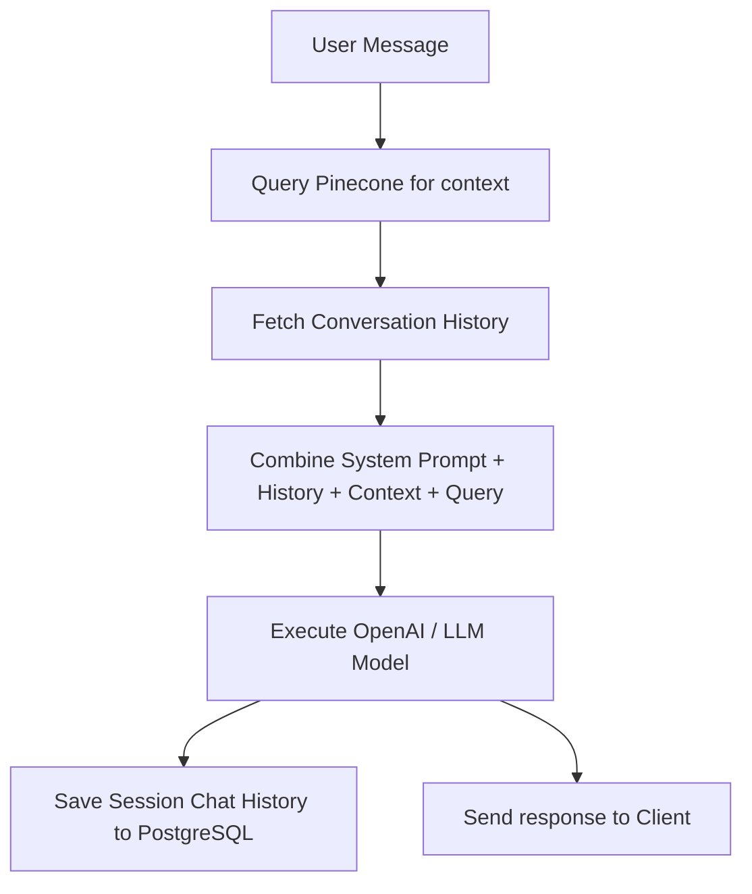

# Phase 3: AI Assistant & Customer Chat Widget

This document details the architecture, LLM agent parameters, memory stores, and frontend UI design systems for **Phase 3: Customer Chat Widget & RAG Routing**.

---

## 1. Goal
Implement a customer-facing interactive Chat Widget styled in the **Vintage Editorial** theme. Build the backend orchestration to handle vector context searches, integrate a conversation memory buffer, and structure the LLM prompt templates to answer customer requests.

---

## 2. Agent Architecture & Prompt Design

The backend uses LangChain orchestration. Upon receiving a message, the chatbot queries Pinecone for context and injects relevant snippets directly into the LLM system prompt.



### System Prompt Template
```
You are the Velora AI Shopping Assistant, an elegant, helpful, and sophisticated concierge representing Velora E-Commerce. 
Your tone must reflect our design ethos: classic, publication-grade, intellectual, yet warm and concise. 

Answer the user's questions using ONLY the context provided below. If you do not know the answer or if the context does not contain it, state politely that you are unable to find that information and offer to connect them with a human operator.

---
RELEVANT KNOWLEDGE BASE CONTEXT:
{context}
---

CONVERSATION HISTORY:
{history}

Customer Query: {query}
Velora Concierge Response:
```

---

## 3. Database Schema (Chat Memory Store)

To ensure persistent chat memory across user sessions, create database tables to hold session logs:

```sql
-- 1. CHAT SESSIONS TABLE
CREATE TABLE public.chat_sessions (
    id UUID PRIMARY KEY DEFAULT uuid_generate_v4(),
    customer_id UUID REFERENCES public.customers(id) ON DELETE SET NULL,
    session_token VARCHAR(255) NOT NULL UNIQUE,
    user_agent TEXT,
    ip_address VARCHAR(100),
    created_at TIMESTAMPTZ NOT NULL DEFAULT CURRENT_TIMESTAMP,
    updated_at TIMESTAMPTZ NOT NULL DEFAULT CURRENT_TIMESTAMP
);

-- 2. CHAT MESSAGES TABLE
CREATE TABLE public.chat_messages (
    id UUID PRIMARY KEY DEFAULT uuid_generate_v4(),
    session_id UUID NOT NULL REFERENCES public.chat_sessions(id) ON DELETE CASCADE,
    sender VARCHAR(50) NOT NULL CHECK (sender IN ('user', 'assistant')),
    message TEXT NOT NULL,
    sources JSONB DEFAULT '[]', -- References to document chunks or product SKUs
    created_at TIMESTAMPTZ NOT NULL DEFAULT CURRENT_TIMESTAMP
);

CREATE INDEX idx_chat_messages_session ON public.chat_messages(session_id);
```

---

## 4. UI/UX Design System (Vintage Editorial Widget)

To preserve visual coherence, build the React chat widget inside [customer/src/components/ChatWidget.jsx](file:///d:/VELORA/customer/src/components/ChatWidget.jsx) utilizing our defined design tokens:

### Visual Guidelines:
*   **Palette**:
    *   Widget Canvas Background: Cream (`#F5F1E8`)
    *   Header and CTA Highlights: Deep Leather / Accent (`#8B5E3C`)
    *   Borders and Primary Text: Charcoal (`#2F2F2F`)
    *   User Message Bubble: Soft Warm Off-White (`#FAF8F3`) with thin borders
*   **Typography**:
    *   Widget Title: *Cormorant Garamond* (Serif), size `text-xl`, font-semibold.
    *   Messages and Input: *Inter* (Sans-serif) for high legibility.
*   **Borders**: Sharp-bordered container blocks, thin divider rules (`border-half border-[#2F2F2F]/20`), no rounded bubbles. Use a retro offset shadow (`shadow-vintage-flat`).

### Micro-Animations (Framer Motion)
```javascript
export const widgetAnimations = {
  container: {
    initial: { opacity: 0, scale: 0.95, y: 15 },
    animate: { opacity: 1, scale: 1, y: 0, transition: { duration: 0.3 } },
    exit: { opacity: 0, scale: 0.95, y: 15, transition: { duration: 0.2 } }
  }
};
```

---

## 5. Verification Plan

### Manual Verification
1.  Open the customer portal in a browser (http://localhost:5173).
2.  Click the floating Chat Widget button at the bottom right.
3.  Type a question about a product or policy (e.g., "What is your return policy?").
4.  Confirm:
    - The response includes information matching the uploaded text context.
    - Sources or links are presented at the bottom of the response.
    - Chat history remains visible when closing and reopening the chat frame.
